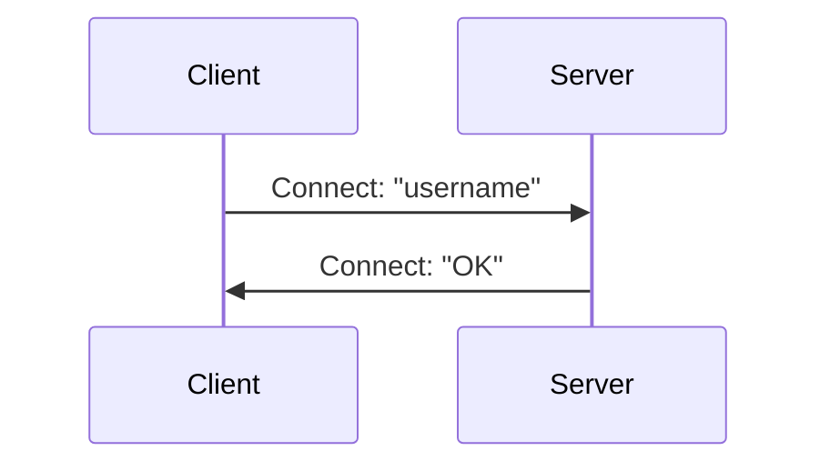
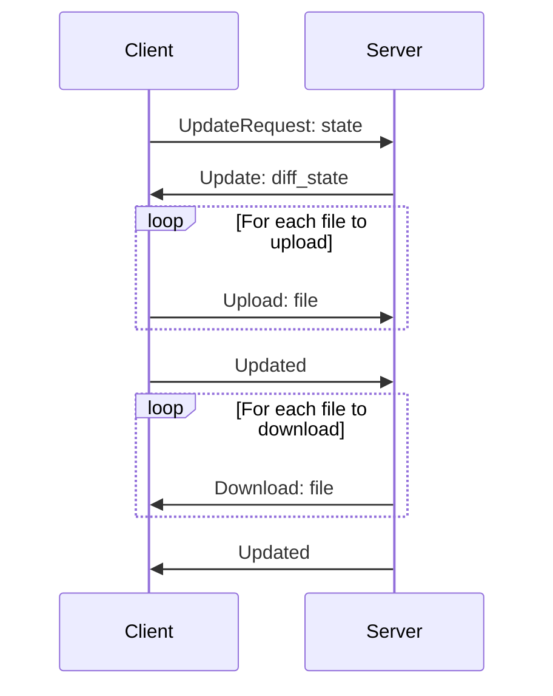
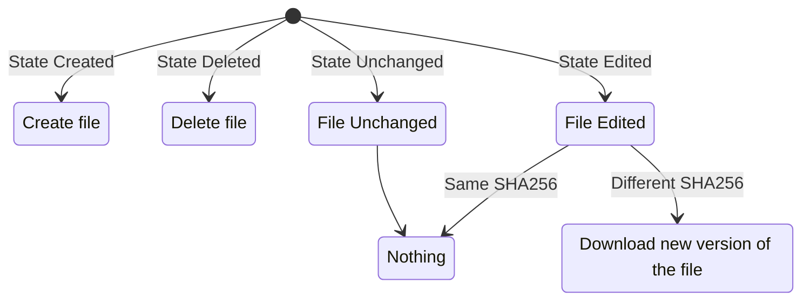

# SyncMeDaddy

## How it works

### Connection

```mermaid
sequenceDiagram
    Client->>Server: Connect: "username"
    Server->>Client: Connect: "OK"
```

### Update

```mermaid
sequenceDiagram
    Client->>Server: UpdateRequest: state
    Server->>Client: Update: diff_state
    loop For each file to upload
        Client->>Server: Upload: file
    end
    Client->>Server: Updated
    loop For each file to download
        Server->>Client: Download: file
    end
    Server->>Client: Updated
```

```mermaid
stateDiagram-v2
    s1 : Create file
    s2 : Delete file
    s3 : File Edited
    s4 : File Unchanged
    s5 : Nothing
    s6 : Download new version of the file

    [*] --> s1 : State Created
    [*] --> s2 : State Deleted
    [*] --> s3 : State Edited
    [*] --> s4 : State Unchanged
    s3  --> s5 : Same SHA256
    s3  --> s6 : Different SHA256
    s4  --> s5
```
